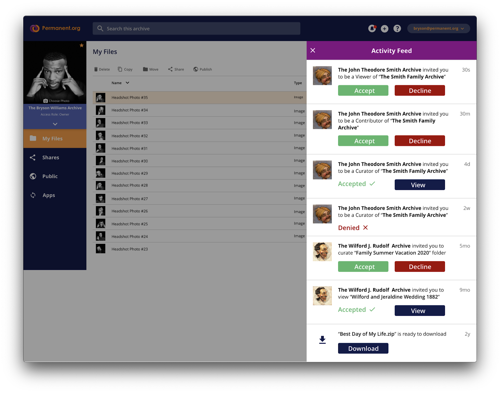

# Design Doc

## Objective

To Create a new Notification system in TypeScript to provide users with better feeds and more features.

## Goals

Our current notification feed has many limitations. It is specific to a selected archive and doesn’t include all the notifications generated in the system.
Also our current notifications don’t have actionable buttons which can help users navigate easily in the app and save a lot of time.
The proposed notification system will be able to eliminate all the limitations of the current notification system and also be able to provide users with better features like actionable buttons.

## Overview

Previously we have been displaying notifications for each archive and hence the notifications feeds were also configured to fetch data based on the archive. Our design has never considered providing users with an ability to take action right from the notification feed. In recent years, new features haven't been rolled out with accompanying notifications, which has left the notifications feed limited in the types of notices it displays to users.
The new UI design has combined all feeds into one account notification feed, and also has actionable buttons corresponding to each feed. The limitations of the current notification system calls for a redesign and re-architecture. Below you can find the new UI 

## Detailed Design

We will create a new microservice, preferably in TypeScript and a new database , the chosen one is PostgreSQL. Microservice will make it easier to open source the new service in a usable way for other people. This will also offer a fresh codebase with correct process(es), preparing for a better-designed future. The endpoints will be directed through current API for authentication and authorization.
Users will also be provoded with options to set preferences for each set of notifications. This microservice will also send emails and push notifications. We are planning to use Firebase Cloud Messaging client for push notifications.
Notifications won’t be updated when the underlying data is updated.
